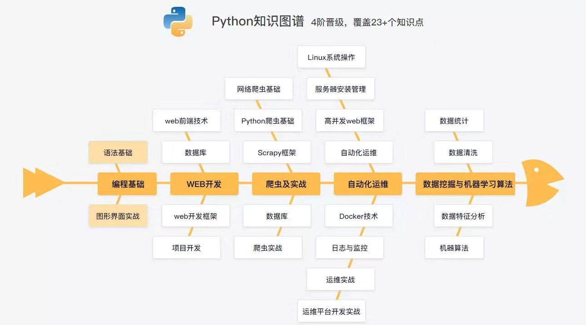

# AI 学习笔记
## 一. 基础环境篇
- [x] 1. [服务器系统安装](base/README.md)
- [x] 2.  [Anaconda环境安装](base/anaconda.md)
- [x] 3.  [Docker学习](base/docker.md)
- [x] 4. [Ovirt学习](base/Ovirt.md)
- [ ] 5.  [Jupyter-notebook环境学习]()

## 二. Python编程基础学习

- [x] 1. [编程基础](program/README.md)
- [ ] 2. [Web开发]()
- [ ] 3.  [自动化运维]()

## 三. 基础数据处理包Numpy
## 四. 数据分析工具PANDAS
## 五. 数据可视化工具Matplotlib
## 六. 机器学习库Scikit-Learn实战
## 七. Python爬虫与数据采集
## 八. 自然语言处理NLP
## 九. 深度学习框架Tensorflow
