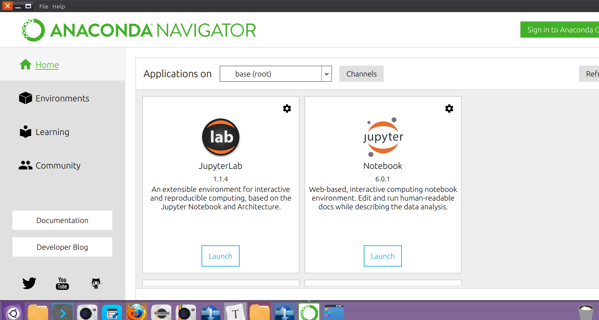

# Jupyter Notebook学习笔记

[返回-首页](../README.md)

## 一. Jupyter NoteBook概览


## 二. Jupyter Notebook学习笔记

### 1. 在windows中自定义Notebook工作目录

Windows中的Notebook可以通过Anoconda3(64-bit)集成安装,安装后可以通过Anaconda Navigate启动。



然而，Jupyter Notebook的默认工作路径是C:\users\用户名，即windows用户的家目录，如何自定义工作目录呢?

* 打开开始菜单——>程序——>Anaconda3程序下，打开Anaconda Pompt

  

* 执行命令，生成jupyter notebook的配置文件

```powershell
jupyter notebook --generate-config
```

打开用户目录下自动生成的配置文件C:\Users\用户名\\.jupyter\jupyter_notebook_config.py

查找到以下配置项

> #c.NotebookApp.notebook_dir = ''

去掉#注释，修改路径如下:

> c.NotebookApp.notebook_dir = 'D:\study\GitHub\AI-Learning-Note\workspace'

启动notebook后工作目录已经改变.

```pow
jupyter notebook --no-browser
```

同理也可以配置Linux下的工作目录。

