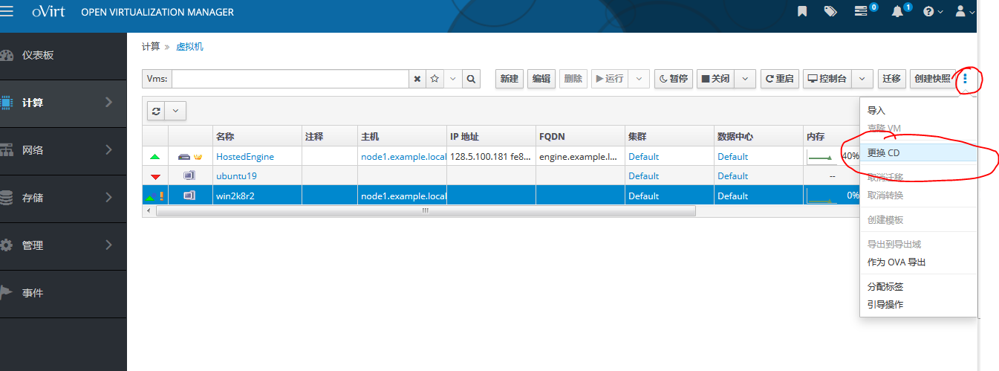
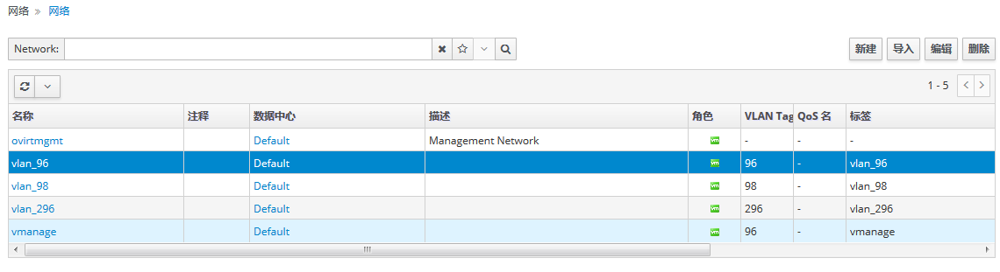

# Ovirt 学习笔记

## 1. Ovirt-node修改IP地址后重启，IP又改变

原因:vdsm服务在重启时更新网桥配置文件ifcfg-ovirtmgmt,需修改vdsm配置文件

```bash
vi /var/lib/vdsm/persistence/netconf/nets/ovirtmgmt
"ipaddr": "修改IP地址",
```

## 2. 部署了self-hosted engine的node节点重启后无法启动ovirt-ha-agent服务

报错提示：The hosted engine configuration has not been retrieved from shared storage. Please ensure that ovirt-ha-agent is running and the storage server is reachable there is an issue with the ovirt-ha-agent service, or with the storage, or both.

原因：配置了glusterfs共享存储，存储没有启动成功，无法挂载。执行以下命令查看volume状态

```bash
#gluster volume status all
Status of volume: export
Gluster process                             TCP Port  RDMA Port  Online  Pid
------------------------------------------------------------------------------
Brick node1:/glusterfs/export               49152     0          Y       14749
 
Task Status of Volume export
------------------------------------------------------------------------------
There are no active volume tasks
 
Status of volume: gfs1
Gluster process                             TCP Port  RDMA Port  Online  Pid
------------------------------------------------------------------------------
Brick node1:/glusterfs/database             49153     0          Y       14780
 
Task Status of Volume gfs1
------------------------------------------------------------------------------
There are no active volume tasks
 
Status of volume: iso
Gluster process                             TCP Port  RDMA Port  Online  Pid
------------------------------------------------------------------------------
Brick node1:/glusterfs/iso                  49154     0          Y       14823
 
Task Status of Volume iso
------------------------------------------------------------------------------
There are no active volume tasks
```

对没有在线的volume强制启动:

```bash
#gluster volume start gfs1 force
```

然后再启动ovirt-ha-agent服务

```bash
# systemctl start ovirt-ha-agent
```


## 3. ovirt安装Windows无法认到硬盘，安装驱动后报windows 0x80300001错误

原因：需要先安装Windows的硬盘驱动，从fedora网站上[下载](https://fedorapeople.org/groups/virt/virtio-win/direct-downloads/archive-virtio/virtio-win-0.1.172-1/) virtio-win.iso ，virtio-win_amd64.vfd  ，virtio-win_x86.vfd 上传到ovirt上的iso域内，在安装windows系统是加载VirtIO驱动：

* 点击 Compute → Virtual Machines.

* 点击 Run → Run Once.

* 打开 Boot Options 菜单

- 选择Attach CD下拉框并选择windows安装的iso文件

- 将 CD-ROM设置为第一启动引导项

- 配置其他需要的 Run Once 选项

- 点击 OK.

启动进入windows安装后，提示认不到硬盘，需要加载驱动，这时把光盘更换成virtio-win.iso后就能加载正确的驱动，对硬盘进行格式化。

这时会提示windows 0x80300001错误，这时因为光盘已被更改成virtio-win.iso，这时候把光盘更改会windows安装光盘就可以。

**注意** :更换光盘一定要通过下图的操作



这个可以更换到原来的windows安装光盘，通过控制台上的文件——>更换设备，**根本找不到**原来的windows安装dvd，我卡在这一块一个月，晕死！！

## 4. ovirt配置vlan网络

ovirt节点主机是多网卡的服务器，其中一个网卡所接网线是Trunk模式。首先进入oVirt管理台，新建网络：

* 点击左边目录选择网络——》网络，点击新建，新建逻辑网络


* 输入名称，勾选启用vlan标签，填写vlan标签值,选择确定保存


按照这个方法创建多个vlan



* 在主机网络上将逻辑网络添加给对应绑定网卡。点击左边目录计算——>主机，点击主机名称，选择网络接口

  

* 设置主机网络，将相关逻辑网络添加到Trunk模式的网卡接口,点击确定保存。

  
  
  
  
  