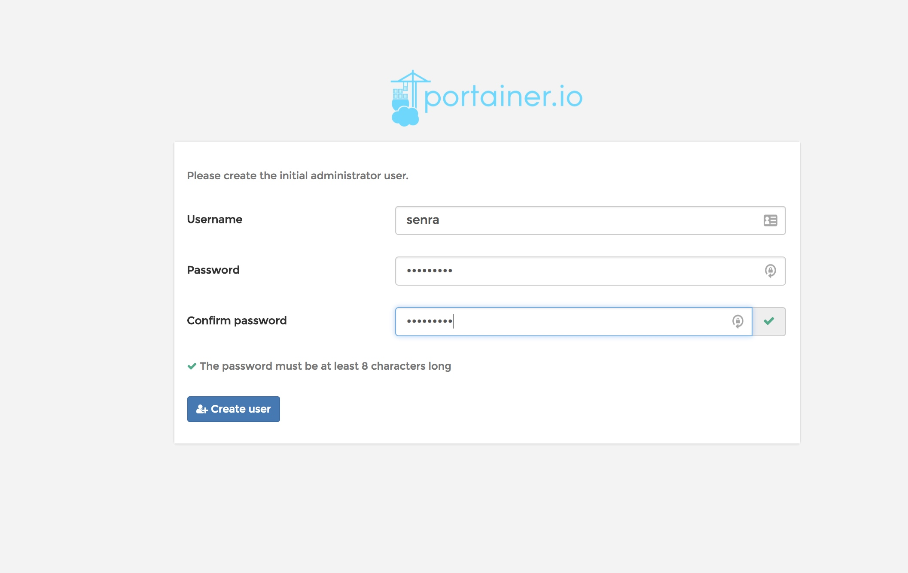
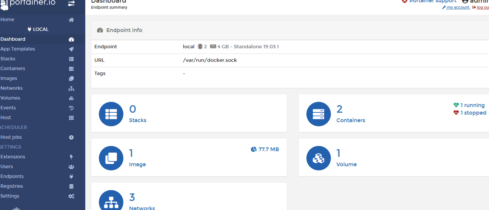

# 服务器系统安装

[返回-首页](../README.md)

## 一. 服务器操作系统规划

### 1. 操作系统空间规划

|      项目      | 内容                 |
| :------------: | -------------------- |
|  操作系统版本  | Centos x64 7         |
|      内存      | 16G                  |
| 主机名HOSTNAME | docker.example.local |

系统分区规划

| 用途       | 卷组名称      | 磁盘\|卷  | 挂载点          | 空间大小 |
| ---------- | ------------- | --------- | --------------- | -------- |
| 启动分区   |               | /dev/sda1 | /boot           | 500M     |
| 系统卷组   | /dev/centosvg | lvroot    | /               | 10G      |
|            |               | lvtmp     | /tmp            | 4G       |
|            |               | lvvar     | /var            | 5G       |
|            |               | lvusr     | /usr            | 6G       |
|            |               | lvswap    | swap            | 2G       |
| Docker卷组 | /dev/dockvg   | lvdock    | /var/lib/docker | 50G      |

### 2. 操作系统安装和配置

按照操作系统的空间规划安装Centos 7操作系统，配置相关服务。

- 关闭selinux

修改`vi /etc/selinux/config`文件:

```bash
	SELINUX=disabled
	:wq
```

`setenforce 0`

- 配置本地yum源

  ```bash
	mkdir -p /media/dvd
	mount /dev/sr0 /media/dvd
  cd /etc/yum.respo.d/
vi local.repo
      [dvd]
      name=dvd
      baseurl=file:///media/dvd
      enabled=1
      gpgcheck=0
  :wq
  ```
  
  

## 二. Docker容器环境安装

### 1. 安装必要系统工具

`yum install -y yum-utils device-mapper-persistent-data lvm2`

### 2. 添加阿里yum源

```bash
yum-config-manager --add-repo http://mirrors.aliyun.com/docker-ce/linux/centos/docker-ce.repo
```

更新 yum 缓存：

`yum makecache fast`

### 3. 安装Docker_ce:

`yum -y install docker-ce`

### 4.  docker加速

```bash
 vi /etc/docker/daemon.json 
{
  "registry-mirrors": ["http://hub-mirror.c.163.com"]
}

```

### 5. 启动docker服务

```bash
systemctl enable docker
systemctl start docker
```

### 6. 测试docker可用

`docker run hello-world`

### 7. 启用GPU支持

安装[nvidia-docker](https://github.com/NVIDIA/nvidia-docker)

```bash
distribution=$(. /etc/os-release;echo $ID$VERSION_ID)
curl -s -L https://nvidia.github.io/nvidia-docker/$distribution/nvidia-docker.repo |tee /etc/yum.repos.d/nvidia-docker.repo
yum install -y nvidia-container-toolkit
systemctl restart docker
```


## 三. Portainer可视化管理

### 1. 添加数据卷

`docker volume create portainer_data`

### 2. 下载并启动portaner

`docker run -d -p 9000:9000 -v /var/run/docker.sock:/var/run/docker.sock -v portainer_data:/data portainer/portainer`

### 3. 通过网页连接测试

打开浏览器连接http://dockerIP:9000/

按照要求创建用户



进入控制台dashboard:




## 四. Tensorflow Docker安装

### 1. 下载镜像

```bash
docker pull tensorflow/tensorflow                     # latest stable release
docker pull tensorflow/tensorflow:devel-gpu           # nightly dev release w/ GPU support
docker pull tensorflow/tensorflow:latest-gpu-jupyter  # latest release w/ GPU support and Jupyter
```

### 2. 测试TensorFlow安装成功

```bash
docker run -it --rm tensorflow/tensorflow \
python -c "import tensorflow as tf; tf.enable_eager_execution(); print(tf.reduce_sum(tf.random_normal([1000, 1000])))"
```

详细用法参考:[官方文档](https://tensorflow.google.cn/install/docker)

