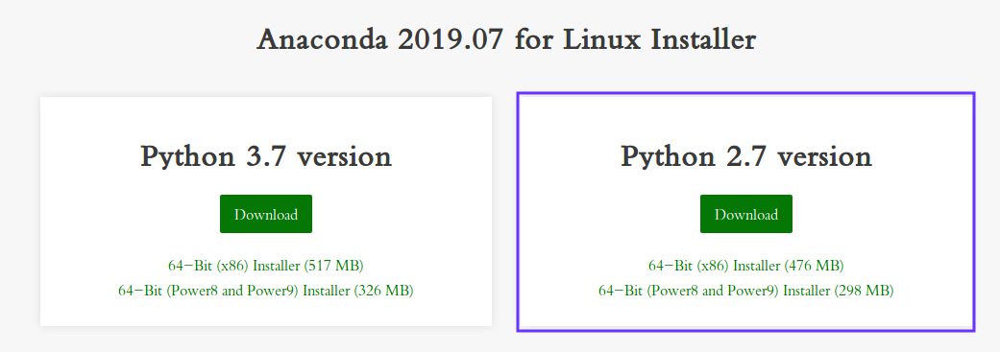

# Ununtu下安装Anaconda

[返回-首页](../README.md)

## 一. Anaconda介绍

- 最流行的支持Python和R语言的数据科学和机器学习应用平台。
- 简单部署，跨操作系统支持，支持Linux,Mac,Windows

## 二. Anaconda下载安装

1. 下载安装包

https://www.anaconda.com/distribution/

根据python版本下载对应安装，我的电脑安装的python2.7，所以下载python2.7版本的Anacoda安装包。

2. 安装Anaconda

下载完成后执行`sh Anaconda2-2019.07-Linux-x86_64.sh`进行安装