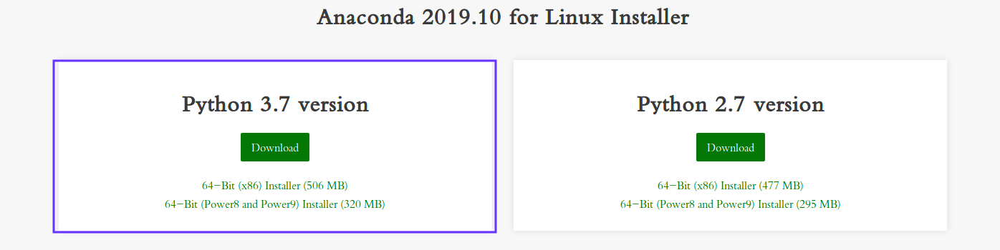
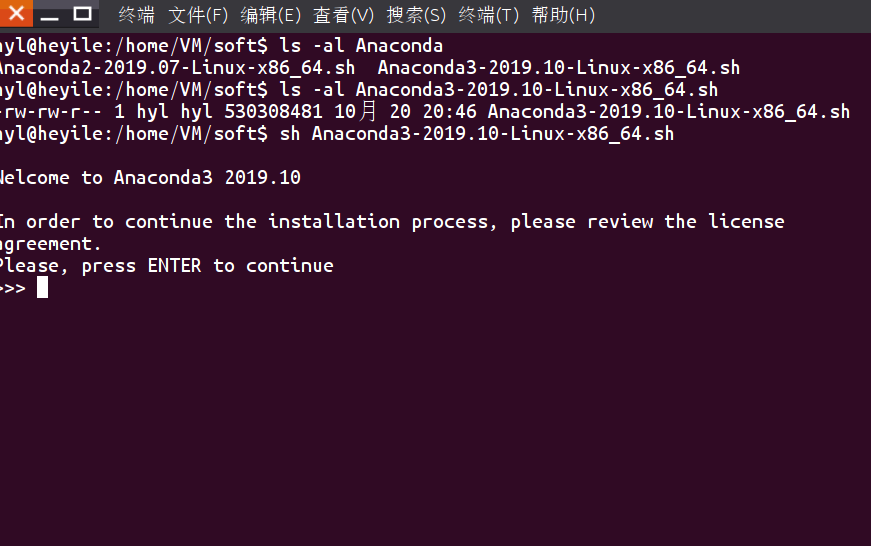
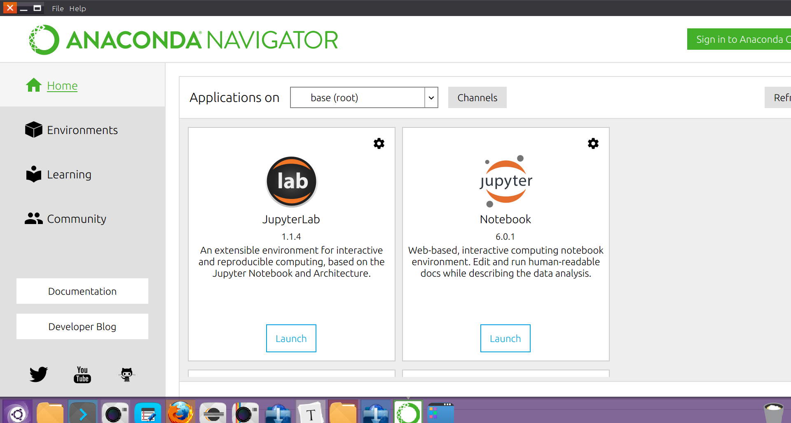
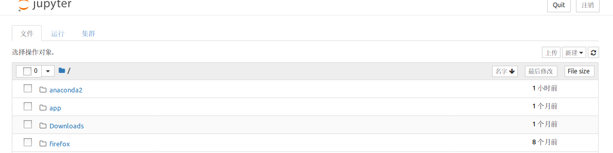
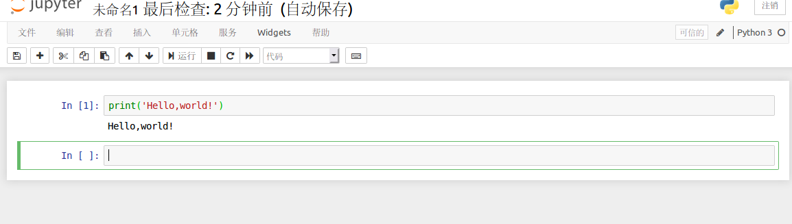
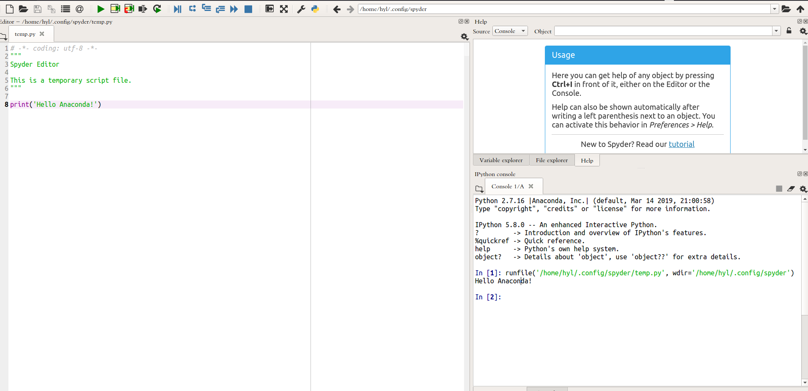

# Ununtu下安装Anaconda

[返回-首页](../README.md)

## 一. Anaconda介绍

- 最流行的支持Python和R语言的数据科学和机器学习应用平台。
- 简单部署，跨操作系统支持，支持Linux,Mac,Windows
- 由于python即将全面升级到python3，所以为我们下载python3学习
- 关于python2的Anaconda请跳转:[python2的Anaconda安装](./anaconda_for_python2.7.md)

## 二. Anaconda下载安装

1. 下载安装包

https://www.anaconda.com/distribution/#download-section

根据下载支持python3的Anacoda安装包。

2. 安装Anaconda

下载完成后执行`sh Anaconda3-2019.10-Linux-x86_64.sh`进行安装

一路回车到底，安装完成。

3. 启动Anaconda

   执行`$HOME/anaconda3/bin/anaconda-navigate`启动图形界面

   

   

   启动Jupyter Notebook成功！
   
   

点击右边新建一个python文件,测试`print('Hello,Anaconda!')`

测试成功。

从Anaconda Navigator首页下拉滚动条，启动Spyder,测试`print('Hello,Anaconda!')`

Spyder测试成功，可以用这个环境开发python.

