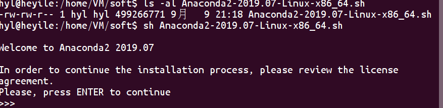
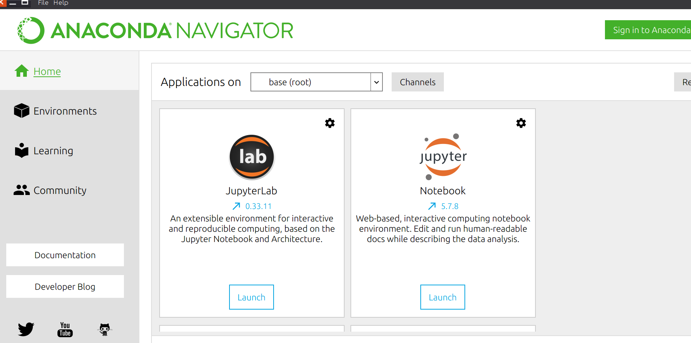
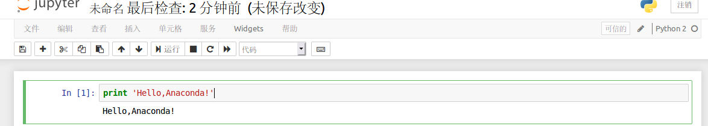

# Ununtu下安装Anaconda

[返回-首页](../README.md)

## 一. Anaconda介绍

- 最流行的支持Python和R语言的数据科学和机器学习应用平台。
- 简单部署，跨操作系统支持，支持Linux,Mac,Windows

## 二. Anaconda下载安装

1. 下载安装包

https://www.anaconda.com/distribution/

根据python版本下载对应安装，我的电脑安装的python2.7，所以下载python2.7版本的Anacoda安装包。

2. 安装Anaconda

下载完成后执行`sh Anaconda2-2019.07-Linux-x86_64.sh`进行安装

一路回车到底，安装完成。

3. 启动Anaconda

   执行`anaconda-navigate`启动图形界面

   

   启动Launch NoteBook，不幸报错：

    `'ascii' codec can't decode byte 0xe5 in position 4: ordinal not in range(128)`
   
   解决方法：
   
   1. 修改文件`/usr/local/anaconda2/lib/python2.7/site.py` , 第481行附近 的函数`def setencoding` 中将 `if 0` 修改为 `if 1`, 这样就会调用 `sys.setdefaultencoding(encoding)`
   2. 修改文件 `/usr/local/anaconda2/lib/python2.7/site-packages/traitlets/traitlets.py` , 第2050行, 将`return value.decode('ascii', 'strict')` 改为 `return value.decode('UTF-8', 'strict')`
   
   启动Jupyter Notebook成功！
   
   

点击右边新建一个python文件,测试`print 'Hello,Anaconda!'`

测试成功。

从Anaconda Navigator首页下拉滚动条，启动Spyder,测试`print 'Hello,Anaconda!'`

Spyder测试成功，可以用这个环境开发python.

