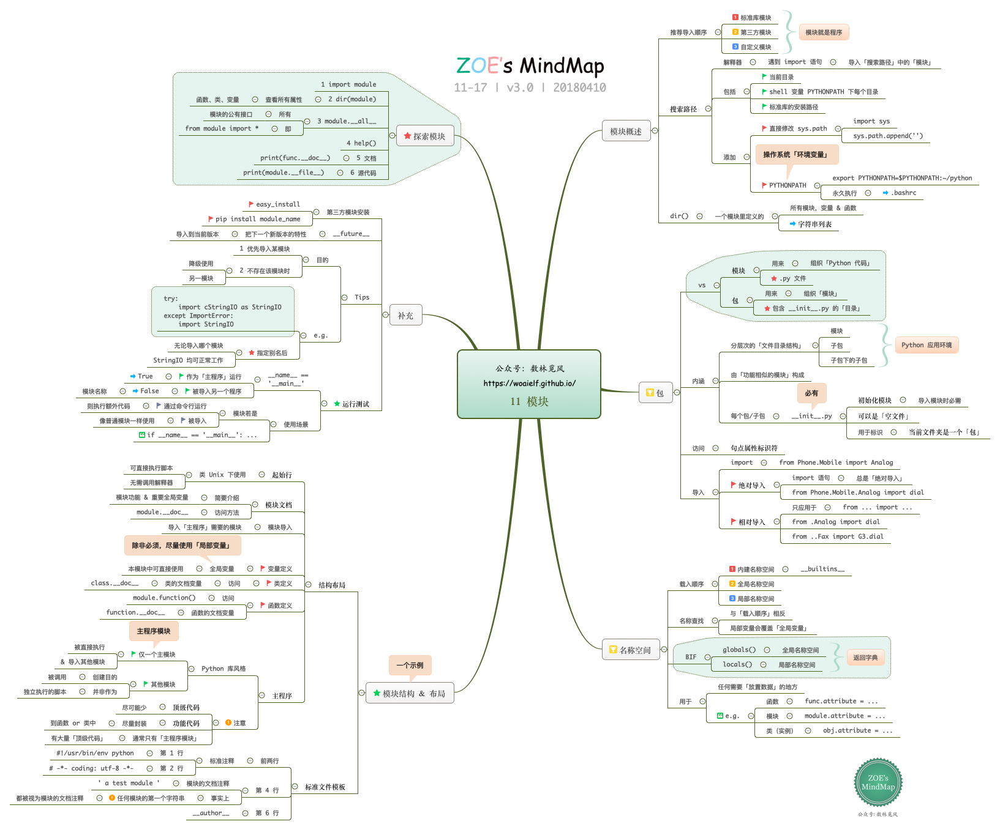

# (转) 17幅思维导图——Python核心知识体系

[返回--编程基础](README.md)

## 1. 计算机基础

## 2. python语言基础

## 3. 标准数据类型（一） 数值 & 字典 & 集合

## 4. 标准类型补充

## 5. 标准数据类型 （二） 序列对象

## 6. 标准数据类型 （三） 字符串

## 7. 条件|循环

## 8. 【进阶】条件|循环

## 9. 函数|模块

## 10. 【进阶】函数

## 11. 模块

## 12. 面向对象编程

## 13. 【进阶】面向对象编程

## 14. 【进阶】补充知识

## 15. 文件对象

## 16. 异常处理

## 17. 测试|调试

