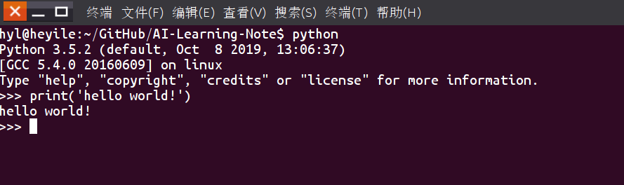
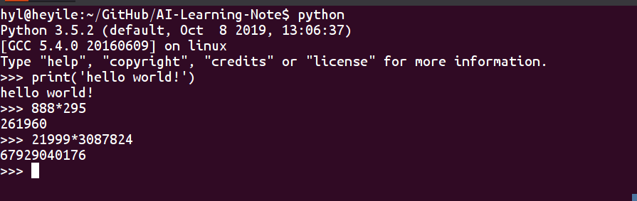

# python3 学习笔记

## 一. Python的沟通方式

### 1. 很随意

命令行运行python，进入后就可以输命令



还可以当计算器用

	

### 2. 也很严谨

在python源文件的开头，有些需要加编码声明，防止乱码，如下：

```python
# -*- coding: utf-8 -*-
```

python源文件需要严格的空格对齐，通过对 齐来区分不同的模块，也让程序更具有可读性，如下：

```python
# -*- coding:utf-8 -*-
#类定义，这时一个人
class person:
    #这个人的基本属性,姓名，年龄
    name = ''
    age = 0
    #私有属性，体重
    __weight=0
    #初始化，给这些属性赋值的方法，也叫定义构造方法
    def __init__(self,n,a,w):
        self.name=n
        self.age=a
        self.__weight=w
    def selfintro(self):
        print('My name is %s.I am %d years old'%(slef.name,self.age))
#实例化类，就是把抽象的人具体成有名字、年龄、体重等具体信息的人
p=person('John',10,80)
p.selfintro()
```

## 二. 跟Python随便聊两句


