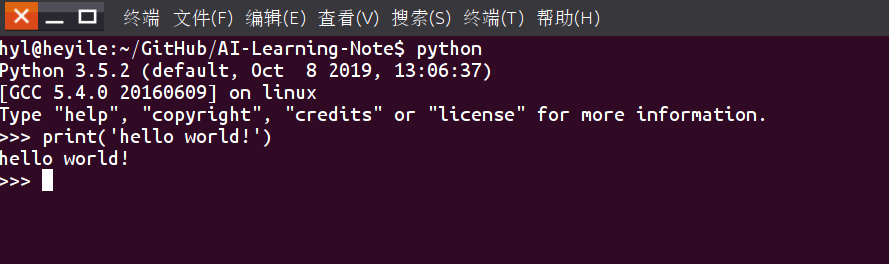
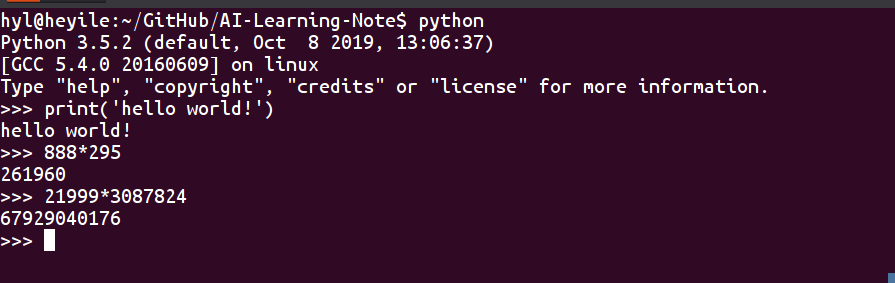

# python3 学习笔记

## 一. Python的沟通方式

### 1. 很随意

命令行运行python，进入后就可以输命令



还可以当计算器用



### 2. 也很严谨

在python源文件的开头，有些需要加编码声明，防止乱码，如下：

```python
# -*- coding: utf-8 -*-
```

python源文件需要严格的空格对齐，通过对 齐来区分不同的模块，也让程序更具有可读性，如下：


```python
# -*- coding:utf-8 -*-
#类定义，这时一个人
class person:
    #这个人的基本属性,姓名，年龄
    name = ''
    age = 0
    #私有属性，体重
    __weight=0
    #初始化，给这些属性赋值的方法，也叫定义构造方法
    def __init__(self,n,a,w):
        self.name=n
        self.age=a
        self.__weight=w
    def selfintro(self):
        print('My name is %s.I am %d years old'%(self.name,self.age))
#实例化类，就是把抽象的人具体成有名字、年龄、体重等具体信息的人
p=person('John',10,80)
p.selfintro()
```

    My name is John.I am 10 years old


## 二. 跟Python随便聊两句

###  1. 关于Python3语法的一些注意

* 默认UTF-8，可以修改文件头部注释指定不同编码

```python
# -*- coding: cp-1252 -*-
```

* 数据类型

  * 整数&长整数： a=1234567890

  * 浮点数: a=3.1415926 、b=3E-2
  * 复数: a=1+2j

  * 字符串
    * python中单引号和双引号使用完全相同。
    * 使用三引号('''或""")可以指定一个多行字符串。
    * 转义符 '\'
    * 自然字符串， 通过在字符串前加r或R。 如 r"this is a line with \n" 则\n会显示，并不是换行。
    * python允许处理unicode字符串，加前缀u或U， 如 u"this is an unicode string"。
    * 字符串是不可变的。
    * 按字面意义级联字符串，如"this " "is " "string"会被自动转换为this is string。


```python

```
